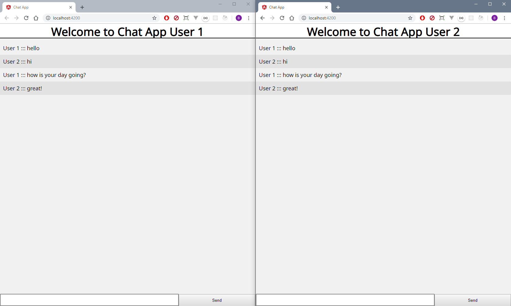

# Chat App 
Simple chat app for web, built with socket.io and angular

### Installation
This app requires TypeScript v3.4+ to run.

Install the dependencies and devDependencies and start the server.

```sh
`$ cd ./backend`
`$ npm install` 
`$ npm start` 
`open another command prompt on app directory`
`$ cd frontend` 
`$ npm install` 
`$ ng serve -o` 
```

### Development

Want to contribute? Great!

This app uses node.js, express and socket.io for fast developing.
And you can chenk todos, for something to develop.
Happ Hacing!

### Todos

- Add night mode
- Add online users list

### Screenshot



License
----

MIT